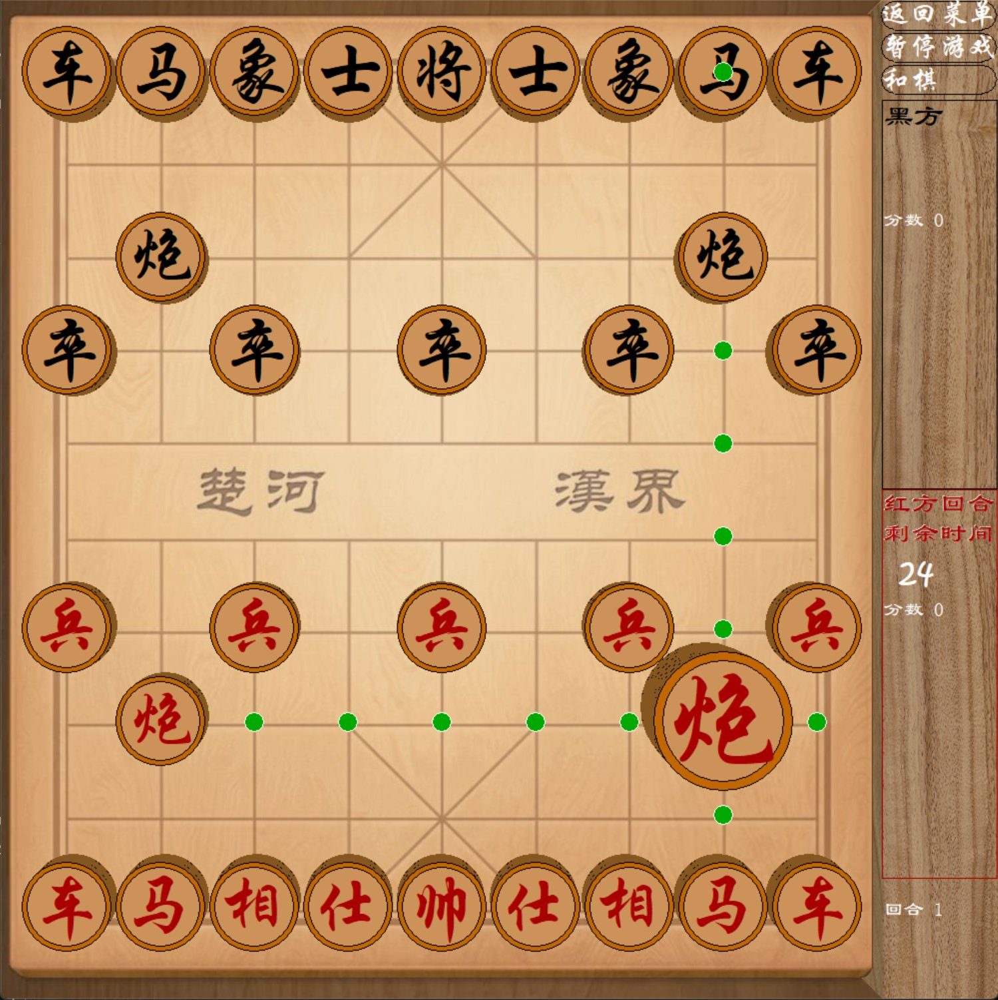

# 中国象棋

> 时光匆匆，翻到大一 C 语言的课程设计。当时还不会用 AI，原汁原味古法编程，屎山代码，发到 GitHub 供大家品鉴。

C 语言 + EGE 图形库写的图形化中国象棋，约 2200 行。

一点透视，伪3D；流畅移动动画，吃棋特效；落点显示；将军、绝杀判断；每步限时 45 秒，超时判负；双方各有一次悔棋机会；支持存档读档、暂停、和棋，对局记录。

## 运行

已经编译好了，双击 `中国象棋.exe` 直接玩。不用担心有病毒，没那水平。。qwq

想自己编译：用 Dev-C++ 打开 `中国象棋.dev`，编译运行（需要先装好 EGE 图形库，挺麻烦）。
